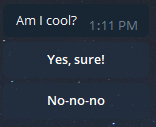
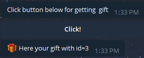

<p align="center">
    
</p>
<h2 align="center">Ant:Telegram</h2>
<p align="center">
  Tiny but powerful framework for <a href="https://telegram.org/">Telegram</a> chat bots.
</p>
<p align="center">
    <a href="https://core.telegram.org/bots/api">
        
    </a>
    <a href="https://www.npmjs.com/package/ant-telegram">
        
    </a>
    <a href="https://www.npmjs.com/package/ant-telegram">
        
    </a>
    <a href="https://travis-ci.org/Xeelley/AntTelegram">
        
    </a>
</p>
<p align="center">
  Also check out ants for other messengers: <a href="https://www.npmjs.com/package/ant-viber">AntViber</a>, <a href="https://www.npmjs.com/package/ant-messenger">AntMessenger</a>.
</p>


## List of content ##

About:
- [Basic features](#Basic-features) 
- [Instalation](#Instalation) 
- [Basic usage](#Basic-usage) 
- [Ant anatomy](#Ant-anatomy) 
- [Inline buttons, callback data handling](#inline-buttons-callback-data-handling)
- [Wildcards](#Wildcards)
- [Config](#Config)
- [Webhook and Polling](#Webhook-and-Polling)
- [Examples](#Examples)


## Basic features ##

- Status-based user dialog stage managment.
- Easy-to-use.
- Webhook & polling support.
- All in one: all API methods, flexible dialog flow control.
- w/o functional overkill, nothing extra.


## Instalation ##

- Using [NPM](https://www.npmjs.com/):  
`npm install ant-telegram`
- Using [Yarn](https://yarnpkg.com/en/):  
`yarn add ant-telegram`


## Basic usage ##

Ant:Telegram require to provide 2 basic status managment async methods: for getting status to user by telegram `chat_id`, and for setting it.  
Feel free to chose storing way (architecture, database etc.). We require next interfaces only:
```ts
getStatus(chat_id: Number): Promise<String>;
setStatus(chat_id: Number, status: String): Promise<any>;
``` 

**Notice**: `getStatus` must returns `null` or `undefined` when called for user for a first time (when user not exist and status not found).

Just put in on Ant:Telegram initialization with [telegram bot token](https://core.telegram.org/bots#3-how-do-i-create-a-bot):
```js
const { AntTelegram } = require('ant-telegram');

const token = '...'; // Your telegram bot token

const Ant = new AntTelegram(token, { 
    getStatus: (chat_id) => { ... }, 
    setStatus: (chat_id, status) => { ... },
});
```

Explore quick start [example](docs/mongo-status-example.md) using [MongoDB](https://www.mongodb.com/) + [mongoose](https://www.npmjs.com/package/mongoose).

Now you ready to use Ant:Telegram.  
Let's add start dialog handler (`/start` command):  
  
... using command handlers:
```js
Ant.command('/start', async chat_id => {
    await Ant.bot.sendMessage(chat_id, 'Hi!');
})
```
... or `onStart` method:
```js
Ant.onStart((chat_id, value, message) => {
    await Ant.bot.sendMessage(chat_id, 'Hi!');
});
```

Your bot ready to start. Run script and make sure it works:  


## Ant anatomy ##

### Telegram API 

See `Ant.api`

All api methods like 
```ts
Ant.api.sendMessage(chat_id: Number, text: String, options? TelegramOptions): Promise;
Ant.api.deleteChatStickerSet(chat_id: Number, form: TelegramForm): Promise;
``` 
... and so on. See full list in [node-telegram-bot-api](https://www.npmjs.com/package/node-telegram-bot-api) dependency.

### Events

```js
// Telegram API response errors
Ant.on('error', err => { ... })
// Telegram polling errors
Ant.on('polling_error', err => { ... })
// Telegram webhook errors
Ant.on('webhook_error', err => { ... })
// Errors caused during user's scenario (status errors, access restrictions, ivalid inputs etc.)
Ant.on('chat_error', (chat_id, err) => { ... })
```
Also Ant:Telegram has `Error` generalization:
```js
Ant.on('Error', err => { ... })
```
`Error` will fire on any error. If error caused during user's scenario (`chat_error`), error will have `chat_id` extra field.


### Statuses

Set status for user:
```js
await Ant.status(id, 'my_status');
```

And add listener for this status: 
```js
Ant.add('photo', 'my_status', (chat_id, photo) => { ... })
```
First argument is user interaction type, second - our status, third - callback.  
Callback will invoke every time when user with this status send photo to bot.  
Full list of available types and callbacks you can check [here](docs/event-types.md).

### Commands

Add command handlers using `Ant.command`:
```js
Ant.command(command, (chat_id, params, message) => { ... })
```
Command may contain `/` if needed (example: `/start`).
Callback will invoke every time when user send this command to chat. Status will be ignored (works with any user's status).  
  
`Ant.command` support url params for commant that will returns as `params` in callback. Empty object will returns if params not provided.  
For example:  

| User input | `params` value |
|------------|----------------|
| `/cmd` | `{}` |
| `/cmd?item=apple&amount=2` | `{ item: 'apple', amount: '2' }` |

**Notice:** all param values are strings. You need to parse params by youself if you need to support other types in command params.  

`message` is native API response (see [Telegram.Message](https://core.telegram.org/bots/api#message)).

**Notice:** `/start` command using [deep linking](https://core.telegram.org/bots#deep-linking) with params will send message not in url format, so you need to use `Ant.onStart` method to handle it.  
For example: 
```js
/**
 * @description
 * Link t.me/yourbot?start=reflink 
 * will send message "/start reflink"
 * which isn't in url format. So you need to use method below.
 */
Ant.onStart((chat_id, value, message) => {
    console.log(value); // -> reflink
});
```
| Link | `value` |
|------|---------|
| t.me/yourbot | `""` |
| t.me/yourbot?start=reflink | `"reflink"` |


### Masks 

You can use multi-leveled statuses using level separator (`:` by default). It can be changed using `maskSeparator` field in initial config.   
For example: 
```js
await Ant.status(chat_id, 'buy:fruit:apple')
```
Provided status has 3 levels: action (`buy`), category (`fruit`), item (`apple`) and can be used during user interaction  with shopping cart.  
You not need to set listeners using `Ant.add` for each item on third level. You can use mask (`*`):
```js
// Mask value (item, in our case) will be provided as third callback parameter.
Ant.add('message', 'buy:fruit:*', (chat_id, text, item) => {
    console.log(item) // apple
})
```
Callback will invoke for any text message send by user with any item in status.

### Builders ### 
See `Ant.Types`

Ant:Telegram simplifies api methods usage with builders.  
Let's check an example:
```js
await Ant.sendMessage(chat_id, 'Am I cool?', new Ant.Types.InlineKeyboard([
    [ new Ant.Types.InlineButton('Yes, sure!', 'yes') ],
    [ new Ant.Types.InlineButton('No-no-no', 'no') ]
]))
```
Here we are using builders instead of define `options` object.  
This code will send text message with two inline buttons:  



**Notice:** if you are working in [Typescript](https://www.typescriptlang.org/) environment you need to use `Ant.sendMessage` method (outside `api`). In javascript project feel free to use either `Ant.sendMessage` or `Ant.api.sendMessage`.


## Inline buttons, callback data handling ##
Using [builders](#Builders) you can define `callback_data` type and data directly (second and third parameter in `Ant.Types.InlineButton`).  
Example:
```js
await Ant.api.sendMessage(chat_id, 'Click button below for getting gift', Ant.Types.InlineKeyboard([
    [ Ant.Types.InlineButton('Click!', 'gift', { id: 3 }) ],
]))
```
It will send test message with inline button that have `gift` type and data.  
How to handle it? Use known `Ant.add` handler!
```js
Ant.add('callback_query', 'gift', async (chat_id, data, message_id) => {
    console.log(data) // { id: 3 }
    await Ant.api.sendMessage(chat_id, `🎁 Here your gift with id=${data.id}`)
})
```
Callback will get data from inline buttons with pointed type:  



**Notice**: Ant:Telegram `Ant.Types.InlineKeyboard` builder add `callback_data` to message.  
`callback_data` is stringified JSON-string that looks like `{t: type, d: data}` and have 64 character length limit (see [Telegram API docs](https://core.telegram.org/bots/api#inlinekeyboardbutton)).  
Knowing it, your both `type` string and `data` must be at total less then **55** characters. API error (`error` event) will called otherwise.  
  
**Also notice**: `Ant.add('callback_query', ...)` listner will handle only queries created with [Builders](#builders). For handling native queries (sent witout [Builders](#builders)) you need to use API events via `Ant.api.on('callback_query')`.


## Wildcards
Ant:Telegram support next wildcards:

### Type wildcard
You can set wildcard listener for provided status using `*` that will be called after each user's message (type doesn't matter).  
Native API message (`Telegram.Message`) will be passed as parameter.  
Let's check an example:
```js
Ant.add('*', 'your_status', message => {
    console.log(message) // Telegram.Message here!
})
```


## Config ##
Ant:Telegram init config contain next fields:

| field | type | description |
|-------|------|-------------|
| `setStatus` | | See [basic usage](#Basic-usage) 
| `getStatus` | | See [basic usage](#Basic-usage) 
| `maskSeparator` | `string` | See [masks](#Masks)
| `useWebhook` | `boolean` | See [webhook and polling](#Webhook-and-Polling) 


## Webhook and Polling ##
Ant:Telegram use [long-polling](https://en.wikipedia.org/wiki/Push_technology#Long_polling) for communicate with Telegram API by default.  
If you need use webhook instead of long-polling, follow next steps:

1. Pass `useWebhook` to Ant:Telegram options
```js
const Ant = new AntTelegram(token, { useWebhook: true, ... })
```
2. Set webhook url using API `setWebHook` method:
```js
await Ant.api.setWebHook(url, options)
```
Now your webhook is ready to receive incoming messages.


## Examples ##
- [Todo List Bot](examples/todo-list.md) - simple todos manager.


