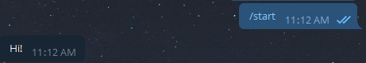

<h2 align="center">Ant:Telegram</h2>
<p align="center">
  Tiny but powerful framework for <a href="https://telegram.org/">Telegram</a> chat bots.
</p>


## Basic features

- Status-based user dialog stage managment.
- Easy-to-use.
- Webhook & polling support.
- All in one: all API methods, flexible dialog flow control.
- w/o functional overkill, nothing extra.


## Instalation

- NPM:
`npm install ant-telegram`


## Basic usage

Ant:Telegram require to provide 2 basic status managment async methods: for getting status to user by telegram `chat_id`, and for setting it.  
Feel free to chose storing way (architecture, database etc.). We require next interfaces only:
```ts
getStatus(chat_id: Number): Promise<string>;
setStatus(chat_id: Number, status: String): Promise<any>;
``` 

Just put in on Ant:Telegram initialization with [telegram bot token](https://core.telegram.org/bots#3-how-do-i-create-a-bot):
```js
const AntTelegram = require('../dist').AntTelegram;

const token = '...';

const Ant = new AntTelegram(token, { 
    getStatus: (chat_id) => { ... }, 
    setStatus: (chat_id, status) => { ... },
});
```

Explore quick start [example](docs/mongo-status-exmaple.md) using [MongoDB](https://www.mongodb.com/) + [mongoose](https://www.npmjs.com/package/mongoose).

Now you ready to use Ant:Telegram.  
Let's add start dialog handler (`/start` command):
```js
ant.command('/start', chat_id => {
    ant.bot.sendMessage(chat_id, 'Hi!')
    .catch(err => { ... });
})
```

Your bot ready to start. Run script and make sure it works:  



## Ant anatomy

### Telegram API (`Ant.api`)

All api methods like 
```ts
Ant.api.sendMessage(chat_id: Number, text: String, options? TelegramOptions): Promise;
Ant.api.deleteChatStickerSet(chat_id: Number, form: TelegramForm): Promise;
``` 
... and so on. See full list in [node-telegram-bot-api](https://www.npmjs.com/package/node-telegram-bot-api) dependency.

### Events
```js
// Telegram API response errors
Ant.on('error', err => { ... })
// Telegram polling errors
Ant.on('polling_error', err => { ... })
// Telegram webhook errors
Ant.on('webhook_error', err => { ... })
// Errors caused during user's scenario (status errors, access restrictions, ivalid inputs etc.)
Ant.on('chat_error', (chat_id, err) => { ... })
```

### Statuses

Set status for user:
```js
Ant.status(id, 'my_status').then(...).catch(...)
```

And add listener for this status: 
```js
Ant.add('photo', 'my_status', (chat_id, photo) => { ... })
```
First argument is user interaction type, second - our status, third - callback.  
Callback will invoke every time when user with this status send photo to bot.  
Full list of available types and callbacks you can check [here](docs/event-types.md).

### Commands

Add command handlers using `Ant.command`:
```js
Ant.command(command, (chat_id, message) => { ... })
```
Command may contain `/` if needed (example: `/start`).
Callback will invoke every time when user send this command to chat. Status will be ignored (works with any user's status).

### Masks 

You can use multi-leveled statuses using level separator (`:` by default). It can be changed using `maskSeparator` field in initial config.   
For example: 
```js
Ant.status(chat_id, 'buy:fruit:apple')
```
Provided status has 3 levels: action (`buy`), category (`fruit`), item (`apple`) and can be used during user interaction  with shopping cart.  
You not need to set listeners using `Ant.add` for each item on third level. You can use mask (`*`):
```js
// Mask value (item, in our case) will be provided as third callback parameter.
Ant.add('message', 'buy:fruit:*', (chat_id, text, item) => {
    console.log(item) // apple
})
```
Callback will invoke for any text message send by user with any item in status.

### Builders

